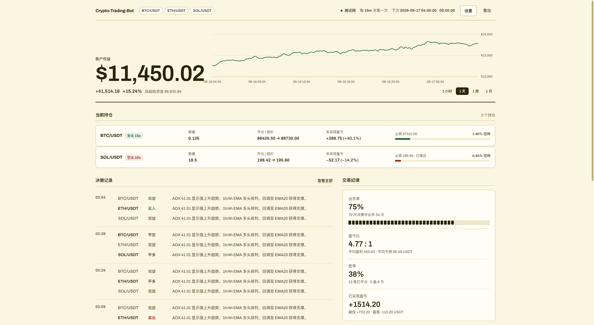

# 🤖 Crypto Trading Bot (Go Version)

**English** | [简体中文](README.md)

---

An AI agent-based cryptocurrency automated trading system - **Go implementation**

Uses Large Language Models (LLM) to analyze market data, generate trading signals, and execute trades on Binance Futures. Built with **Cloudwego Eino Framework** for multi-agent parallel orchestration.




> ⚠️ **Important Notice**: This project has been completely refactored from Python to Go for higher performance and better concurrency.

---

## 💡 Trading Philosophy

This bot follows a **trend-following, highly selective** trading approach:

### Core Principles
1. **Extreme Selectivity** - Only trade the most certain opportunities, "better to miss than make mistakes"
2. **High Risk-Reward Ratio** - Target R:R ≥ 2:1, pursue big wins
3. **Let Winners Run** - Set reasonable initial stop-loss, give trends room to develop
4. **Patient Waiting** - Wait for high-probability setups, doing the right thing > doing many things
5. **One Big Win > Ten Small Wins** - Focus on capturing trending moves

### Decision Rules (Absolute Priority)

1. **Capital Utilization Limits** (Used Margin / Total Balance)
    - < 30%: Normal trading
    - 30-50%: Only open positions with confidence ≥ 0.88
    - 50-70%: Only open with confidence ≥ 0.92 AND R:R ≥ 2.5:1
    - > 70%: No new positions allowed

2. **Confidence Threshold**: ≥ 0.8 to trade, HOLD most of the time

3. **Risk-Reward Requirement**: ≥ 2:1

4. **Fixed Stop-Loss**: Set once at entry, don't adjust

### Decision Framework

**Step 1: Order Book & Funding Rate Analysis (50% weight)**
- **Order Book**: Bid/Ask volume ratio, large order walls (support/resistance)
- **Funding Rate**: Positive (longs overheated), Negative (shorts overheated)
- **24h Volume**: Breakout + high volume = genuine breakout

**Step 2: Traditional Technical Analysis (50% weight)**
- Only trade in **strong trends** (ADX > 25)
- Avoid **chasing** (be cautious at RSI extremes)
- MACD, Bollinger Bands, Moving Averages as **confirmation signals**

---

## ✨ Core Features

### 🎯 Intelligent Trading
- **Multi-Agent Parallel Analysis**: Market Analyst, Crypto Analyst, and Sentiment Analyst working in parallel
- **LLM-Driven Decisions**: Supports OpenAI-compatible APIs (OpenAI, DeepSeek, etc.)
- **Dynamic Leverage**: Intelligently adjusts leverage (e.g., `10-20x`) based on confidence, trend strength (ADX), and volatility (ATR)
- **External Prompt Management**: Adjust trading strategies without recompilation
- **Separate K-line & Execution Intervals**: Calculate indicators from fine-grained data (e.g., 3m) while making decisions at lower frequency (e.g., 15m)

### 🛡️ Risk Management
- **LLM-Driven Stop-Loss**: LLM analyzes market every 15 minutes and provides intelligent stop-loss recommendations
- **Server-Side Stop-Loss Orders**: Binance server-side orders execute 24/7, even if local program crashes
- **Real-time Position Monitoring**: System checks and updates stop-loss in real-time
- **Breakeven & Trailing Stops**: Automatically move to breakeven at 1:1 profit, trail at 2:1+

### 📊 Multi-Symbol Support
- **Parallel Analysis**: Analyze multiple pairs simultaneously (BTC/USDT, ETH/USDT, SOL/USDT, etc.)
- **Intelligent Selection**: LLM evaluates and selects optimal trading opportunities
- **Independent Position Management**: Each pair has independent stop-loss and risk control

### 🌐 Web Monitoring Dashboard
Organised around three questions, in order: **am I up, what am I exposed to, was it disciplined.**
- **Equity**: current equity, P&L against starting capital, and an equity curve with a
  reference line at the starting balance
- **Positions**: side, leverage, entry vs mark, unrealised P&L, and **how much room is
  left before the stop triggers** (warning state under 1.5%)
- **Decisions**: every decision including the **holds**, each with the model's own
  rationale — selectivity is the strategy, so hiding holds hides the evidence for it
- **Discipline**: selectivity (one mark per decision, so the trade/hold rhythm is
  visible at a glance), **win/loss ratio**, win rate, realised P&L
- **Accessibility**: every text token meets WCAG AAA contrast; figures carry no colour
  and state their own sign, so reading a value never depends on hue

### 💾 Data Persistence
- **SQLite Database**: Store trading sessions, position history, balance snapshots
- **Query Tool**: CLI tool for quick historical data queries
- **Balance History Tracking**: Auto-save balance snapshots every 5 minutes

---

## 🏗️ Tech Stack

- **Language**: Go 1.21+
- **Workflow Orchestration**: [Cloudwego Eino](https://github.com/cloudwego/eino)
- **Web Framework**: [Hertz](https://github.com/cloudwego/hertz)
- **Exchange API**: [go-binance](https://github.com/adshao/go-binance)
- **Configuration**: [Viper](https://github.com/spf13/viper)
- **Logging**: [zerolog](https://github.com/rs/zerolog)
- **Database**: SQLite3

---

## 🚀 Quick Start

### Prerequisites

- **Go 1.21 or higher**
- Binance Futures account
- OpenAI-compatible API Key (OpenAI, DeepSeek, etc.)

### Installation

```bash
# Clone the repository
git clone https://github.com/Oakshen/crypto-trading-bot.git
cd crypto-trading-bot

# Install dependencies
make deps

# Build all components
make build-all
```

### Configuration

1. Copy the configuration template:
```bash
cp .env.example .env
```

2. Edit `.env` file with required parameters:

```env
# ===================================================================
# LLM Configuration (OpenAI-compatible API)
# ===================================================================
LLM_PROVIDER=openai
DEEP_THINK_LLM=deepseek-reasoner      # For final trading decisions
QUICK_THINK_LLM=deepseek-chat         # For data analysis
LLM_BACKEND_URL=https://api.deepseek.com
OPENAI_API_KEY=your-api-key-here

# Trading Strategy Prompt
TRADER_PROMPT_PATH=prompts/trader_optimized.txt

# ===================================================================
# Binance Trading Configuration
# ===================================================================
BINANCE_API_KEY=your-binance-api-key
BINANCE_API_SECRET=your-binance-api-secret

# Proxy (optional, for users who cannot access Binance directly)
# BINANCE_PROXY=http://192.168.0.226:6152

# Dynamic Leverage (RECOMMENDED)
BINANCE_LEVERAGE=10-20  # LLM chooses leverage in 10-20x range based on confidence

# Position Mode (IMPORTANT: Use one-way mode)
BINANCE_POSITION_MODE=oneway  # Options: oneway (recommended), hedge, auto

# ===================================================================
# Trading Parameters
# ===================================================================
# Trading Pairs (support multiple pairs)
CRYPTO_SYMBOLS=BTC/USDT,ETH/USDT,SOL/USDT

# K-line Data Interval (for calculating technical indicators)
CRYPTO_TIMEFRAME=3m

# System Execution Interval (how often to run analysis)
TRADING_INTERVAL=15m

# ⭐ BEST PRACTICE:
#   - Fine-grained K-line (3m) + Low-frequency decisions (15m)
#   - More precise technical indicators while avoiding overtrading
#   - Example: CRYPTO_TIMEFRAME=3m, TRADING_INTERVAL=15m

# ===================================================================
# Multi-Timeframe Analysis (RECOMMENDED)
# ===================================================================
ENABLE_MULTI_TIMEFRAME=true
CRYPTO_LONGER_TIMEFRAME=4h  # Use 4h data for trend context

# ===================================================================
# Risk Management
# ===================================================================
ENABLE_STOPLOSS=true  # Enable LLM-driven stop-loss management

# Sentiment Analysis (NOT RECOMMENDED - high latency, low value)
ENABLE_SENTIMENT_ANALYSIS=false

# ===================================================================
# Execution Mode (IMPORTANT)
# ===================================================================
# ⚠️ WARNING: Start with false, test thoroughly before setting to true
AUTO_EXECUTE=false  # Set to true to enable automatic trading

# Web Monitoring
WEB_PORT=8080
```

### Running

```bash
# Single execution mode (runs once and exits)
make run

# Web monitoring mode (continuous + web interface)
make run-web

# UI preview only: sample data, no API keys, never places an order
make run-ui

# Query historical data
make query ARGS="stats"                 # View statistics
make query ARGS="latest 10"             # Last 10 sessions
make query ARGS="symbol BTC/USDT 5"     # Specific symbol
```

Web interface default address: `http://localhost:8080`

---

## 📖 Usage Guide

### 1. Recommended Workflow for Beginners

**Step 1: Test with AUTO_EXECUTE=false**
```env
AUTO_EXECUTE=false
BINANCE_POSITION_MODE=oneway
```
Run `make run-web` and observe LLM decisions for 1-2 days

**Step 2: Enable Auto-Execution**
```env
AUTO_EXECUTE=true
```
Monitor closely, ready to stop the system if needed

**Step 3: Optimize Strategy**
- Adjust leverage range based on results
- Fine-tune trading prompts in `prompts/trader_optimized.txt`
- Monitor balance chart and position performance

### 2. Understanding Timeframe Configuration

**Scenario 1: Standard Mode** (K-line interval = Execution interval)
```env
CRYPTO_TIMEFRAME=15m
TRADING_INTERVAL=15m  # (or omit, defaults to CRYPTO_TIMEFRAME)
```
Result: Fetch 15m candles every 15 minutes

**Scenario 2: Fine-grained K-line + Low-frequency Decisions** (⭐ RECOMMENDED)
```env
CRYPTO_TIMEFRAME=3m      # Calculate indicators from 3m candles
TRADING_INTERVAL=15m     # Make decisions every 15 minutes
```
Benefits:
- More precise technical indicators (EMA, MACD, RSI based on 3m data)
- Avoid overtrading (only decide every 15 minutes)
- Best of both worlds: precision + patience

**Scenario 3: NOT RECOMMENDED** (K-line interval > Execution interval)
```env
CRYPTO_TIMEFRAME=1h
TRADING_INTERVAL=15m
```
Issue: Run every 15 min but 1h candles don't update, wasting API calls

### 3. Custom Trading Strategy

Edit `prompts/trader_optimized.txt` to modify trading strategy without recompilation:

```bash
# Use different prompt file
TRADER_PROMPT_PATH=prompts/trader_aggressive.txt
```

Available strategy templates:
- `trader_optimized.txt` - Trend trading, highly selective (recommended)
- `trader_system.txt` - Trend trading, balanced approach
- `trader_aggressive.txt` - Scalping, actively captures opportunities

### 4. Multi-Symbol Configuration

```bash
# Monitor multiple pairs simultaneously
CRYPTO_SYMBOLS=BTC/USDT,ETH/USDT,SOL/USDT

# System analyzes in parallel and selects best opportunities
# Recommendation: Don't exceed 3 pairs to avoid over-diversification
```

### 5. Real-time Data Access

```bash
# Web API endpoints
curl http://localhost:8080/api/balance/current    # Real-time balance
curl http://localhost:8080/api/balance/history    # Balance history
curl http://localhost:8080/api/positions          # Current positions
curl http://localhost:8080/api/performance        # Selectivity / win-loss ratio / win rate
```

> Want to look at the interface without Binance or LLM credentials? Run `make run-ui`.
> It serves the same pages against a seeded sample dataset, needs no API keys, and
> **never places an order**.

---

## 📁 Project Structure

```
crypto-trading-bot/
├── cmd/
│   ├── main.go           # Single execution mode entry
│   ├── web/main.go       # Web monitoring mode entry
│   ├── uipreview/main.go # UI preview (sample data, never trades)
│   └── query/main.go     # Data query tool
├── internal/
│   ├── agents/           # AI agents (Eino Graph workflow)
│   ├── dataflows/        # Market data and indicator calculation
│   ├── executors/        # Trade execution and stop-loss management
│   ├── portfolio/        # Portfolio management
│   ├── storage/          # SQLite database
│   ├── scheduler/        # Time scheduler
│   ├── web/              # Web server and templates
│   ├── config/           # Configuration loading
│   └── logger/           # Logging system
├── prompts/              # External prompt files
├── data/                 # SQLite database files
├── .env.example          # Configuration template
├── Makefile              # Build scripts
└── README.md
```

---

## 🏗️ Architecture

### Multi-Agent Workflow (Eino Graph)

The system uses Eino Graph to orchestrate multiple AI agents working in parallel:

```
START → [Market Analyst, Sentiment Analyst] (parallel)
           ↓
Market Analyst → Crypto Analyst → Position Info
           ↓                    ↓
    Sentiment Analyst ────→ Trader (Final Decision)
                              ↓
                            END
```

### Market Report Format

**Intraday Report** (based on CRYPTO_TIMEFRAME, e.g., 3m):
```
=== BTC Market Report ===

Current Price = 95123.4, Current EMA(20) = 94567.2, Current MACD = 234.5, Current RSI(7) = 65.3

Intraday Data (3m)

Mid Price: [95100.0, 95150.0, 95200.0, ..., 95123.4]
EMA(20): [94500.0, 94520.0, 94540.0, ..., 94567.2]
MACD: [220.0, 225.0, 230.0, ..., 234.5]
RSI(7): [60.0, 62.0, 64.0, ..., 65.3]
RSI(14): [55.0, 56.0, 58.0, ..., 60.5]
```

**Long-term Report** (CRYPTO_LONGER_TIMEFRAME, e.g., 4h):
```
Long-term Data (4h):

EMA(20): 94567.2 vs. 50-Period EMA: 93500.0
ATR(3): 450.0 vs. 14-Period ATR: 520.0
Current Volume: 1250000.0 vs. Average Volume: 1100000.0
MACD: [200.0, 210.0, 220.0, ..., 234.5]
RSI(14): [55.0, 56.0, 58.0, ..., 60.5]
```

---

## ⚙️ Common Commands

```bash
# Development
make build        # Build main program
make build-all    # Build all components
make test         # Run tests
make test-cover   # Test coverage
make fmt          # Format code
make clean        # Clean build artifacts

# Running
make run          # Single execution
make run-web      # Web monitoring mode

# Query
make query ARGS="stats"                 # Statistics
make query ARGS="latest 5"              # Last 5 sessions
make query ARGS="symbol BTC/USDT 3"     # Specific symbol
```

---

## ⚠️ Security Warnings

**Important Reminders**:

1. **Test Mode First**: Start with `AUTO_EXECUTE=false`, observe for 1-2 days
2. **Start Small**: Begin with minimum position sizes and conservative leverage
3. **Use One-Way Mode**: `BINANCE_POSITION_MODE=oneway` (hedge mode has bugs)
4. **Monitor Operations**: Regularly check web interface and logs
5. **API Security**:
    - Use IP whitelist to restrict API access
    - Never share your API keys
    - Grant only necessary permissions (futures trading only)
6. **Dynamic Leverage**: Use `10-20` range, LLM will choose based on confidence
7. **Stop-Loss Always On**: Keep `ENABLE_STOPLOSS=true` at all times

**Risk Disclaimer**: Cryptocurrency trading carries high risk and may result in capital loss. This software is for educational and research purposes only. Users assume all risks.

---

## 🐛 Troubleshooting

### Common Issues

1. **Balance Chart Not Showing**
    - Ensure the program has been running for at least 5-10 minutes
    - Check database: `sqlite3 data/trading.db "SELECT COUNT(*) FROM balance_history;"`

2. **Next Trade Time Incorrect**
    - Verify `TRADING_INTERVAL` is set correctly in `.env`
    - Web page now shows both "K-line Interval" and "Execution Interval"

3. **Position Display Issues**
    - Confirm `BINANCE_POSITION_MODE=oneway` (recommended)
    - Check actual position mode in Binance account

4. **Compilation Errors**
    - Ensure Go version >= 1.21
    - Run `make deps` to update dependencies
    - Clean and rebuild: `make clean && make build-all`

---

## 📚 More Documentation

- [CLAUDE.md](CLAUDE.md) - Detailed project guide and architecture
- [prompts/README.md](prompts/README.md) - Prompt management and strategy configuration
- [.env.example](.env.example) - Complete configuration parameters
- [docs/STOP_LOSS_GUIDE.md](docs/STOP_LOSS_GUIDE.md) - Stop-loss management guide

---

## 🔄 Migration from Python Version

This project was completely rewritten from Python to Go:

**Major Changes**:
- LangGraph → Eino Graph (Cloudwego)
- CCXT → go-binance (Official SDK)
- pandas → Native Go slice operations
- Flask → Hertz (Cloudwego)

**Advantages**:
- Higher performance and concurrency
- Lower resource consumption
- Faster startup time
- Better type safety

---

## 🤝 Contributing

Issues and Pull Requests are welcome!

---

## 📄 License

[MIT License](LICENSE)

---

**⚡ Powered by Go + Cloudwego Eino + AI**

> For questions or suggestions, please provide feedback in GitHub Issues.
